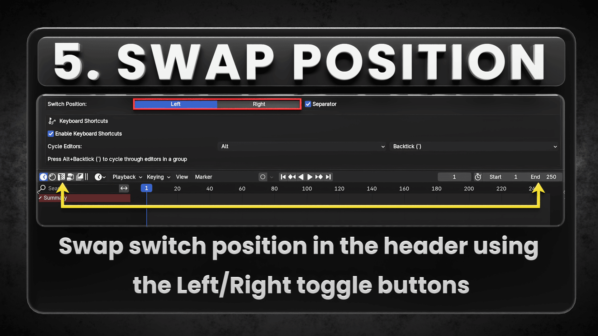
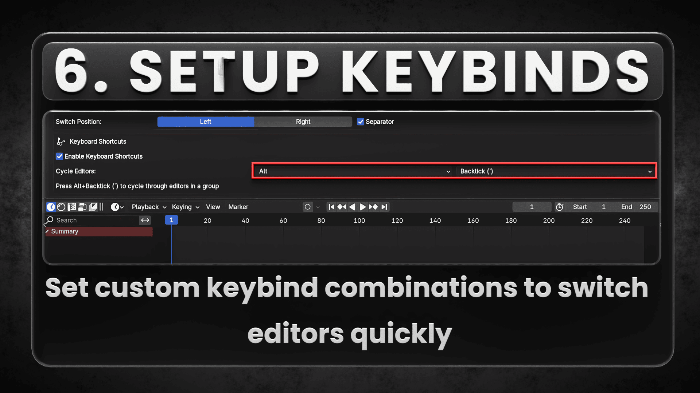
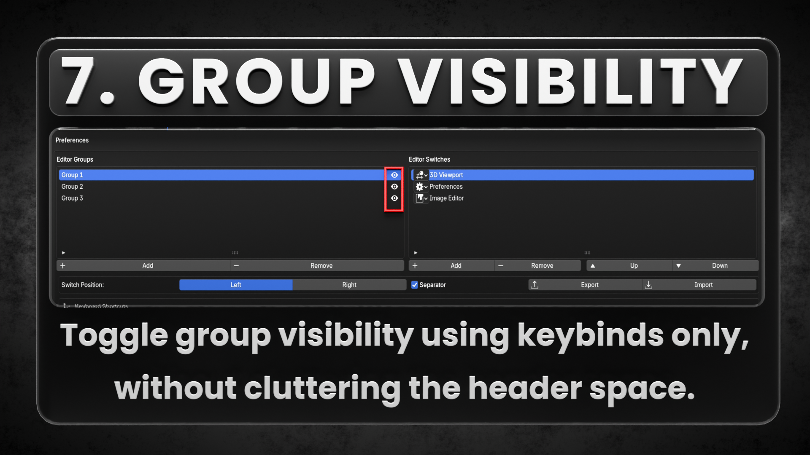
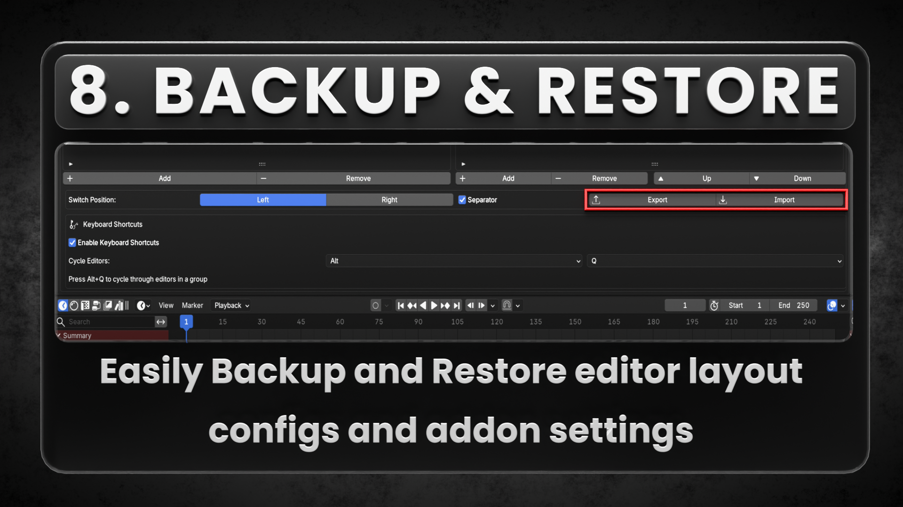

# Documentation
Blender Add-on | A One-click solution to quickly switch between Editor Areas

## INDEX

**Click the links below to directly jump to the desired chapter**

- [Documentation](#documentation)
  - [INDEX](#index)
  - [Overview](#overview)
  - [Key Features](#key-features)
  - [Installation](#installation)
    - [**Official Installation**](#official-installation)
    - [**Alternate method**](#alternate-method)
  - [Setup and Configuration](#setup-and-configuration)
    - [Accessing Preferences](#accessing-preferences)
    - [Creating Editor Groups](#creating-editor-groups)
    - [Adding Editors to Groups](#adding-editors-to-groups)
    - [UI Appearance Settings](#ui-appearance-settings)
    - [Keyboard Shortcuts](#keyboard-shortcuts)
  - [Using the Addon](#using-the-addon)
    - [Switching Editors with UI Buttons](#switching-editors-with-ui-buttons)
    - [Using Keyboard Shortcuts](#using-keyboard-shortcuts)
  - [Supported Editor Areas](#supported-editor-areas)
  - [Support \& Feedback](#support--feedback)
  - [License](#license)

---

## Overview

**Quick Switch** is a Blender add-on designed for users with limited screen space, such as those working on laptops or single-monitor setups. The addon helps reduce UI clutter and improves workflow efficiency by providing a one-click solution to switch between different editor areas.

With **v2.0.0**, the add-on has undergone a complete UI overhaul and now introduces **Grouped Editor** Switching feature, enabling users to define sets of editors and switch between them like browser tabs.

---

## Key Features

- **Header Integration**: Quick switch buttons are automatically added to right most end of the editor headers for seamless navigation.
 
   

- **Grouped Editor Switching (New!)**: Users can define groups of editors and switch between them effortlessly.

   

- **Add Editors**: Add list of editors under each groups.

   

   
- **Reorder Editors**: Move editors up or down within a group to customize the switch sequence.  

   
   
- **Separator Toggle**: Option to enable or disable a visual separator between editor switches and other header operators for better UI clarity.  

   
   
- **Position Toggle**: Option to toggle position of the switches between Left and right side of header.

   
- **Custom Key binding**: Set custom key binding combinations to switch editors quickly (Similar to browser tabs) without interfering with Blender's In-built key binds .

   

- **Visibility Toggle**:Enable / Disable Switch groups from headers while retaining switching functionality via keybinds only

   
  
   
- **Backup / Restore**: Easily Backup / Restore user config and other addon preferences into an external json file

   
  
   
---       

## Installation

### **Official Installation**

1. Open **Blender 4.2+**
2. Navigate to **Edit > Preferences > Get Extensions**
3. Search for **"Quick Switch"**
4. Click **Install**

### **Alternate method**

1. Visit the [Blender Extensions platform](https://extensions.blender.org/add-ons/s3d-quickswitch)
2. Click **Get Add-on** to download from the official page

Or manually download the latest release:

- Download the latest **S3D_QuickSwitch_v2.0.0.zip** from the [GitHub Releases](https://github.com/Silvie3D/S3D_QuickSwitch/releases)
- In Blender, go to **Edit > Preferences > Add-ons**
- Click **Install**, select the downloaded `.zip` file, and enable the add-on

---

## Setup and Configuration

### Accessing Preferences
1. Install the addon through Blender Preferences > Add-ons
2. Access the addon preferences through Edit > Preferences > Add-ons > S3D QuickSwitch

### Creating Editor Groups
1. In the preferences panel, locate the "Editor Groups" section
2. Click "Add" to create a new group
3. Rename the group to something meaningful (e.g., "Modeling", "Texturing", "Animation")

### Adding Editors to Groups
1. Select a group from the "Editor Groups" list
2. In the "Editor Switches" section, click "Add" to add a new editor
3. Select the desired editor type from the dropdown menu
4. Add multiple editors to create a complete workflow group
5. Use the "Up" and "Down" buttons to reorder editors in the group

### UI Appearance Settings
1. In the "Position and Separator" box:
   - Choose "Left" or "Right" for the switch position in editor headers
   - Toggle the separator visibility on/off

### Keyboard Shortcuts
1. In the "Keyboard Shortcuts" box:
   - Enable keyboard shortcuts
   - Select your preferred modifier key (Alt, Ctrl, Shift, or combinations)
   - Select your preferred key to combine with the modifier
   - The current shortcut will be displayed below the selection

## Using the Addon

### Switching Editors with UI Buttons
1. Look for the editor switch buttons in the header of any Blender editor
2. When in an editor that belongs to a group, all editors from that group will be displayed
3. Click on any icon to switch to that editor type
4. The current editor is shown as depressed (highlighted)

### Using Keyboard Shortcuts
1. Place your cursor over an editor area
2. Press your configured shortcut (e.g., Alt+Backtick) to cycle to the next editor in the group
3. Continue pressing to cycle through all editors in the group

---

## Supported Editor Areas

All Editor areas are supported from [v2.1.0](#) update.

---

## Support & Feedback

For any questions, issues, or suggestions, feel free to reach out:

- **Maintainer**: Rabah Ahmed (**Silvie3D**)
- **Email**: [rabahahmed95@gmail.com](mailto:rabahahmed95@gmail.com)
- **Issues**: [S3D_QuickSwitch Issues](https://github.com/Silvie3D/S3D_QuickSwitch/issues)

---

## License

© 2025 Silvie3D

**This add-on is licensed under [GNU General Public License 3.0](https://www.gnu.org/licenses/gpl-3.0.html).**
