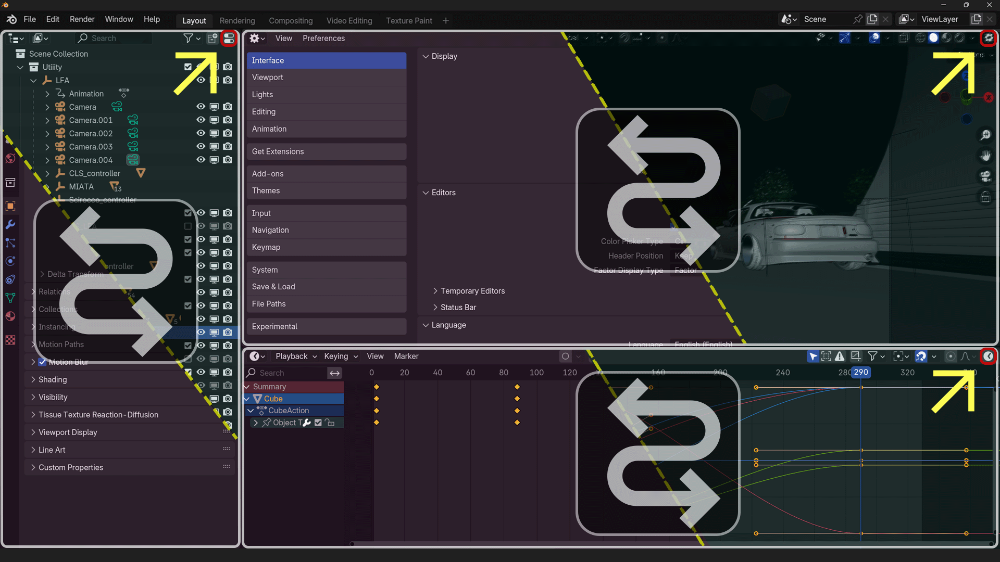
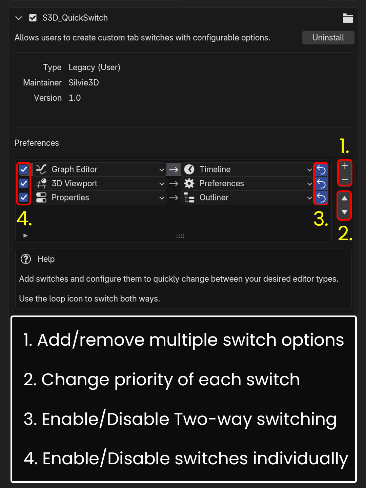
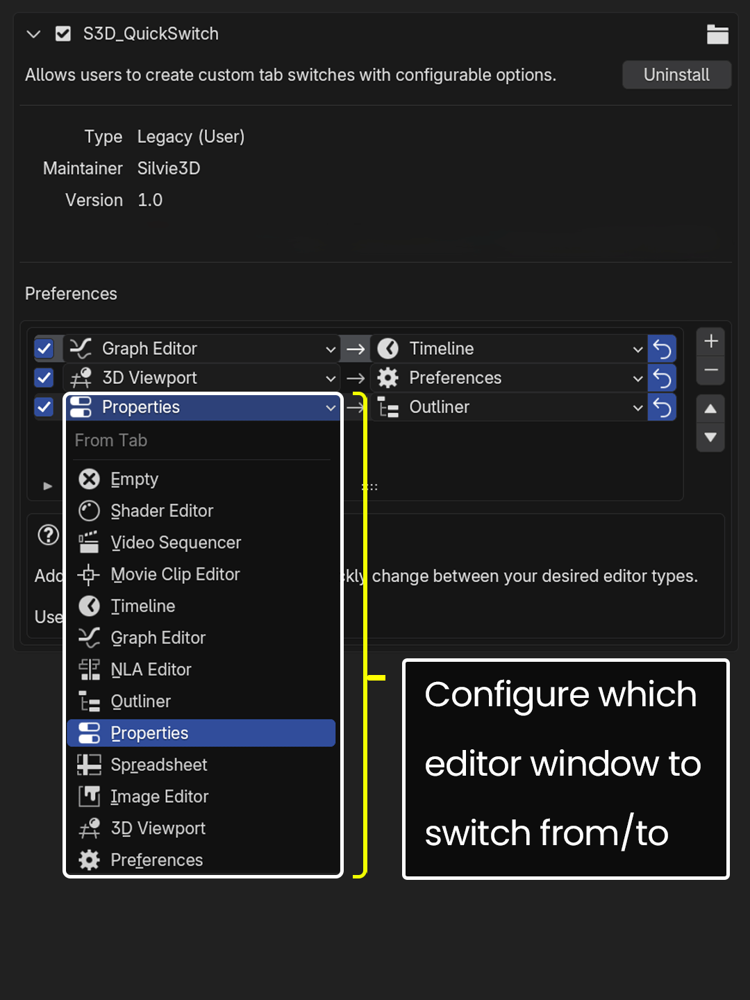

# S3D_QuickSwitch
Blender Add-on | A One-click solution to quickly switch between Editor Areas
# Documentation 

## Overview
**S3D_QuickSwitch** is a Blender addon designed for users with limited screen real estate, such as those working on laptops or single-monitor setups. The addon helps reduce UI clutter and allows users to get things done faster by offering a simple, efficient way to switch between different editor areas with just one click. It is especially useful for users who frequently navigate between Blender's various editors but want to maintain a clean and organized workspace.

## Preview

## Key Features
- **Header Integration**: Quick switch buttons are automatically added to editor headers, allowing for a one-click solution to switch between editor areas without having to navigate menus.
- **Custom Editor Switching**: Define custom switches between editor areas, such as switching from the **3D Viewport** to the **Shader Editor**.
- **Two-Way Switching**: Optional two-way switching feature lets users toggle back and forth between editors with ease.
- **Simple UI**: A minimalistic interface in the preferences panel allows for easy configuration of switches.

  
  

## Installation
1. Visit the Blender Extensions platform to install the addon: [Waiting for approval].
     Alternatively, Download the "S3D_QuickSwitch.zip" from the latest [Release](https://github.com/Silvie3D/S3D_QuickSwitch/releases)
2. Once installed, enable the addon from Blender’s preferences.
3. Create switches and configure them to your liking.

## Usage Instructions
1. After enabling the addon, go to **Edit > Preferences > Add-ons** and locate the **S3D_QuickSwitch** section.
2. Click the **Add Switch** button to define a new editor switch.
3. Configure the following options for each switch:
   - **From Area**: Select the editor area you want to switch from (e.g., 3D Viewport).
   - **To Area**: Select the editor area to switch to (e.g., Shader Editor).
   - **Two-way**: Enabled by default, this option allows to switch between One-way and Two-way mode.
4. A switch button will appear in the header of the active editor area, allowing quick access to your configured switches.

### Example Setup:
- Create a switch from **3D Viewport** to **Shader Editor**.
- A button will appear in the **3D Viewport** and **Shader Editor** header right most end (Refer Preview images), allowing you to switch instantly between then.

## Supported Editor Areas
- 3D Viewport
- Shader Editor
- Video Sequencer
- Properties
- Outliner
- Python Console
- Image Editor
- Text Editor
- And many more.

## Support & Feedback
For any questions, issues, or suggestions, please contact:
- **Maintainer**: Silvie3D
- **Email**: rabahahmed95@gmail.com

## License
© 2024 Silvie3D

**This addon is licensed under [GNU GENERAL PUBLIC LICENSE 3.0].**
